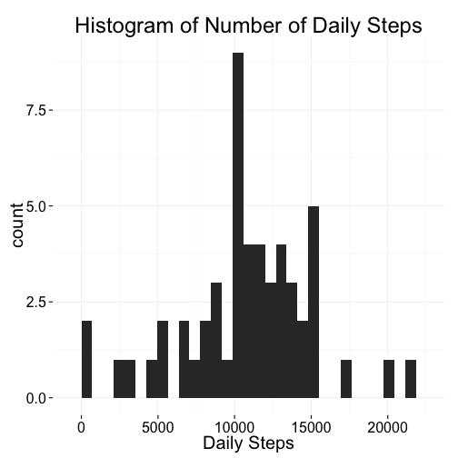
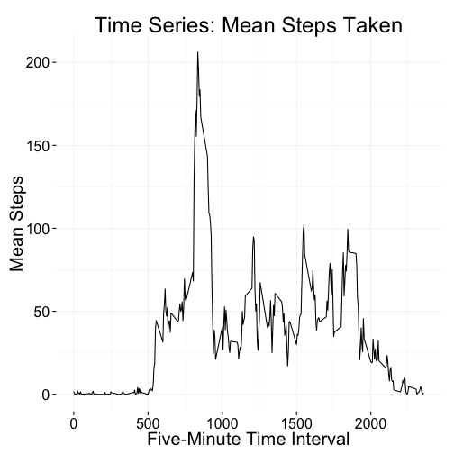
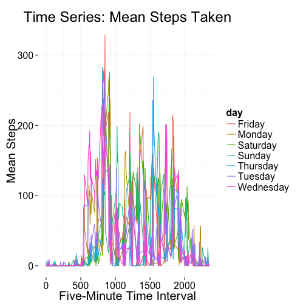
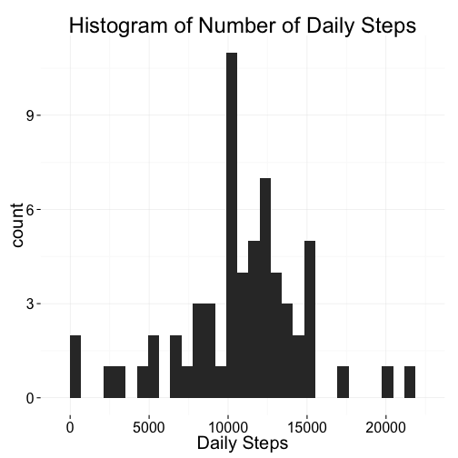
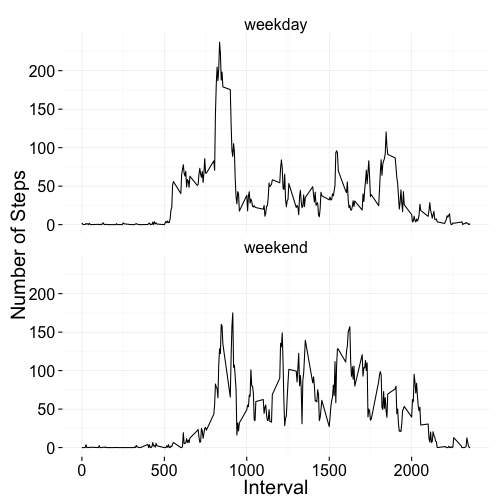

Reproducible Research: Activity Monitoring
========================================
By Tyler Byers

For Coursera Reproducible Research Peer Assessment 1

12 July 2014

----------------------------------------

## Loading and preprocessing the data
Data have been downloaded from the original github repository at:
http://github.com/rdpeng/RepData_PeerAssessment1

```r
library(ggplot2) # Will use ggplot2 for plotting
theme_set(theme_minimal(20)) # ggplot theme
activity <- read.csv('activity.csv', header = TRUE, row.names = NULL)
```


```r
head(activity)
```

```
##   steps       date interval
## 1    NA 2012-10-01        0
## 2    NA 2012-10-01        5
## 3    NA 2012-10-01       10
## 4    NA 2012-10-01       15
## 5    NA 2012-10-01       20
## 6    NA 2012-10-01       25
```

```r
str(activity)
```

```
## 'data.frame':	17568 obs. of  3 variables:
##  $ steps   : int  NA NA NA NA NA NA NA NA NA NA ...
##  $ date    : Factor w/ 61 levels "2012-10-01","2012-10-02",..: 1 1 1 1 1 1 1 1 1 1 ...
##  $ interval: int  0 5 10 15 20 25 30 35 40 45 ...
```

```r
summary(activity)
```

```
##      steps               date          interval   
##  Min.   :  0.0   2012-10-01:  288   Min.   :   0  
##  1st Qu.:  0.0   2012-10-02:  288   1st Qu.: 589  
##  Median :  0.0   2012-10-03:  288   Median :1178  
##  Mean   : 37.4   2012-10-04:  288   Mean   :1178  
##  3rd Qu.: 12.0   2012-10-05:  288   3rd Qu.:1766  
##  Max.   :806.0   2012-10-06:  288   Max.   :2355  
##  NA's   :2304    (Other)   :15840
```

There are 17568 rows, and 2304 of the rows have 'NA' values in the number of steps.  We'll deal with that later.  I don't see much other obvious processing I need to do right now.  I thought about turning the date factor variable into a an actual date (`POSIX`) variable; but later realized this doesn't work well when doing the `dplyr` library in next section.

## What is mean total number of steps taken per day?

### Histogram of Total Number of Steps Per Day

I will create a new data frame using functions from the `dplyr` library. This data frame will simply be the total number of steps taken per day, throwig out `NA` values.  


```r
library(dplyr)
```

```
## 
## Attaching package: 'dplyr'
## 
## The following objects are masked from 'package:stats':
## 
##     filter, lag
## 
## The following objects are masked from 'package:base':
## 
##     intersect, setdiff, setequal, union
```

```r
dates <- group_by(subset(activity, !is.na(steps)), date) # Filter out NAs
activity.by_day <- summarise(dates, dailysteps = sum(steps), n = n())
head(activity.by_day)
```

```
## Source: local data frame [6 x 3]
## 
##         date dailysteps   n
## 1 2012-10-02        126 288
## 2 2012-10-03      11352 288
## 3 2012-10-04      12116 288
## 4 2012-10-05      13294 288
## 5 2012-10-06      15420 288
## 6 2012-10-07      11015 288
```


```r
qplot(dailysteps, data = activity.by_day) + xlab('Daily Steps') + 
    ggtitle('Histogram of Number of Daily Steps')
```

```
## stat_bin: binwidth defaulted to range/30. Use 'binwidth = x' to adjust this.
```

 

### Mean and Median Number of Steps Per Day

There are at least two ways of doing this calculation:

1. Calculate the mean and median of steps per day, including the days where values were all `NA`. 
2. Do the same as #1, but throw out the days were all values were NA.  

I am choosing option 2 -- that is I will calculate the mean and median of the number of steps per day and ignore those days with value of `NA` in all their rows.

The easiest way to do this is just to take a summary of the `activity.by_day` data frame. 


```r
summary(activity.by_day)
```

```
##          date      dailysteps          n      
##  2012-10-02: 1   Min.   :   41   Min.   :288  
##  2012-10-03: 1   1st Qu.: 8841   1st Qu.:288  
##  2012-10-04: 1   Median :10765   Median :288  
##  2012-10-05: 1   Mean   :10766   Mean   :288  
##  2012-10-06: 1   3rd Qu.:13294   3rd Qu.:288  
##  2012-10-07: 1   Max.   :21194   Max.   :288  
##  (Other)   :47
```

So **median** is 10765 steps per day, and **mean** is 10766 steps per day.

Can also calculate it more explicitly:

```r
summarise(activity.by_day, mean(dailysteps), median(dailysteps))
```

```
## Source: local data frame [1 x 2]
## 
##   mean(dailysteps) median(dailysteps)
## 1            10766              10765
```

## What is the average daily activity pattern?

### Time Series Plot of Number of Steps Taken Throughout Day

Will set this one up similar to my `activity.by_day` data frame; this one however is going to be grouped by the time interval.


```r
intervals <- group_by(subset(activity, !is.na(steps)), interval) # Filter out NAs
activity.by_interval <- summarise(intervals, meansteps = mean(steps), n = n())
head(activity.by_interval)
```

```
## Source: local data frame [6 x 3]
## 
##   interval meansteps  n
## 1        0   1.71698 53
## 2        5   0.33962 53
## 3       10   0.13208 53
## 4       15   0.15094 53
## 5       20   0.07547 53
## 6       25   2.09434 53
```

Now plot the mean number of steps per 5-minute interval throughout the day.


```r
ggplot(aes(x = interval, y = meansteps), data = activity.by_interval) + 
    geom_line() + xlab('Five-Minute Time Interval') + ylab('Mean Steps') +
    ggtitle('Time Series: Mean Steps Taken')
```

 

### Highest-Stepping Time Interval

Which 5-minute time interval has the highest mean number of steps during the day?


```r
subset(activity.by_interval, meansteps == max(activity.by_interval$meansteps))
```

```
## Source: local data frame [1 x 3]
## 
##     interval meansteps  n
## 104      835     206.2 53
```

So the time interval during which the most steps on average are taken by the subject is **835**, which corresponds to 0835-0840.  The mean number of steps taken during this time period is 206.1698.

## Imputing missing values

### Number of NAs in the data set


```r
summary(activity)
```

```
##      steps               date          interval   
##  Min.   :  0.0   2012-10-01:  288   Min.   :   0  
##  1st Qu.:  0.0   2012-10-02:  288   1st Qu.: 589  
##  Median :  0.0   2012-10-03:  288   Median :1178  
##  Mean   : 37.4   2012-10-04:  288   Mean   :1178  
##  3rd Qu.: 12.0   2012-10-05:  288   3rd Qu.:1766  
##  Max.   :806.0   2012-10-06:  288   Max.   :2355  
##  NA's   :2304    (Other)   :15840
```

```r
# NA's only appear in the steps column

nrow(subset(activity, is.na(steps)))
```

```
## [1] 2304
```

There are **2304** rows with NA values in them.

### Fill in all the NAs

My strategy will be to find the mean number of steps for each 5-minute period for each day of the week (i.e. perhaps this person takes significantly more steps on a Tuesday than a Monday).  Then I will fill in the NAs with that value for that day of the week.

First I need to create a variable with the days of the week in the activity data frame.


```r
activity$day <- weekdays(strptime(activity$date, '%Y-%m-%d'))
head(activity)
```

```
##   steps       date interval    day
## 1    NA 2012-10-01        0 Monday
## 2    NA 2012-10-01        5 Monday
## 3    NA 2012-10-01       10 Monday
## 4    NA 2012-10-01       15 Monday
## 5    NA 2012-10-01       20 Monday
## 6    NA 2012-10-01       25 Monday
```

Now I will use the `dplyr` package as in the previous section and create conditional means for each weekday and time interval.


```r
daysintervals <- group_by(subset(activity, !is.na(steps)), day, interval)
activity.by_dayint <- summarise(daysintervals, meansteps = mean(steps), n = n())
head(activity.by_dayint)
```

```
## Source: local data frame [6 x 4]
## Groups: day
## 
##      day interval meansteps n
## 1 Friday        0         0 7
## 2 Friday        5         0 7
## 3 Friday       10         0 7
## 4 Friday       15         0 7
## 5 Friday       20         0 7
## 6 Friday       25         0 7
```

I'm curious before I move on, what the mean of daily steps looks like for each day of the week.  Forgive me this little diversion.


```r
ggplot(aes(x = interval, y = meansteps, color = day), 
       data = activity.by_dayint) + geom_line() + 
    xlab('Five-Minute Time Interval') + ylab('Mean Steps') +
    ggtitle('Time Series: Mean Steps Taken')
```

 

Ok that looks a bit busy and it's hard to see much of a pattern, but I think I can see differences in mean steps during different time intervals during different days of the week.

I'll get back on track and put in the missing values for the NAs in the original `activity` data frame. Do this by creating a function `fillin` that fills in the missing values if needed, and calling this function from a `for` loop.


```r
fillin <- function(data) {
    mysteps <- data[,1]
    myint <- data[,3]
    myday <- data[,4]
    if (is.na(mysteps)){
        mysteps <- subset(activity.by_dayint, 
                        day == myday & interval == myint)$meansteps
        
    }
    mysteps
}

for(i in 1:nrow(activity)) {
    activity[i,1] <- fillin(activity[i,])
}
```


### Plot and find stats on fixed data frame

Now that we've "fixed" our data frame by filling in NA values, need to see how the histogram and mean/median look compared to before.

Remember need to do a new group_by and summarise function with our updated data frame.


```r
# Remember uses dplyr package
dates <- group_by(activity, date) # Filter out NAs
activity.by_day <- summarise(dates, dailysteps = sum(steps), n = n())
head(activity.by_day)
```

```
## Source: local data frame [6 x 3]
## 
##         date dailysteps   n
## 1 2012-10-01       9975 288
## 2 2012-10-02        126 288
## 3 2012-10-03      11352 288
## 4 2012-10-04      12116 288
## 5 2012-10-05      13294 288
## 6 2012-10-06      15420 288
```

Plot the histogram.


```r
qplot(dailysteps, data = activity.by_day) + xlab('Daily Steps') + 
    ggtitle('Histogram of Number of Daily Steps')
```

```
## stat_bin: binwidth defaulted to range/30. Use 'binwidth = x' to adjust this.
```

 


```r
summary(activity.by_day)
```

```
##          date      dailysteps          n      
##  2012-10-01: 1   Min.   :   41   Min.   :288  
##  2012-10-02: 1   1st Qu.: 8918   1st Qu.:288  
##  2012-10-03: 1   Median :11015   Median :288  
##  2012-10-04: 1   Mean   :10821   Mean   :288  
##  2012-10-05: 1   3rd Qu.:12811   3rd Qu.:288  
##  2012-10-06: 1   Max.   :21194   Max.   :288  
##  (Other)   :55
```

So new **median** is 11015 steps per day, and new **mean** is 10821 steps per day.

Can also calculate it more explicitly:

```r
summarise(activity.by_day, mean(dailysteps), median(dailysteps))
```

```
## Source: local data frame [1 x 2]
## 
##   mean(dailysteps) median(dailysteps)
## 1            10821              11015
```

These values are a bit different than what was calculated early in the assignment.  In both cases, the values raised; the mean raised quite a bit more than than the mean.  So the impact of imputing data on the calculated total number of steps was, in this case, to raise the calculation.  I could probably find ways to lower the imputed number of steps.  So if we do want to come up with models of ways for imputing the data, we should probably be very careful what methods we use, or else we get garbage out from the garbage we put in.

## Are there differences in activity patterns between weekdays and weekends?

First we need to create a new factor variable in the dataset with two levels – “weekday” and “weekend” indicating whether a given date is a weekday or weekend day.  We are using the data set with the filled-in values for this part.


```r
# Create a factor variable which takes the days of the week 
#  and says whether they are weekday days or weekend days
activity$weekday <- factor(activity$day == 'Saturday' |
                            activity$day == 'Sunday', 
                            levels = c(FALSE, TRUE), 
                            labels = c('weekday', 'weekend'))
head(activity)
```

```
##   steps       date interval    day weekday
## 1 1.429 2012-10-01        0 Monday weekday
## 2 0.000 2012-10-01        5 Monday weekday
## 3 0.000 2012-10-01       10 Monday weekday
## 4 0.000 2012-10-01       15 Monday weekday
## 5 0.000 2012-10-01       20 Monday weekday
## 6 5.000 2012-10-01       25 Monday weekday
```

```r
table(activity$weekday)
```

```
## 
## weekday weekend 
##   12960    4608
```

Now we make a panel plot of the average number of steps taken at each interval for weekdays and weekend days. First I need to create a new data frame as before, and once again will ue `group_by` and `summarise` from the `dplyr` package. 


```r
wkend <- group_by(activity, weekday, interval) 
activity.by_wkend <- summarise(wkend, meansteps = mean(steps), n = n())
head(activity.by_wkend)
```

```
## Source: local data frame [6 x 4]
## Groups: weekday
## 
##   weekday interval meansteps  n
## 1 weekday        0   2.31071 45
## 2 weekday        5   0.45000 45
## 3 weekday       10   0.17500 45
## 4 weekday       15   0.20000 45
## 5 weekday       20   0.08889 45
## 6 weekday       25   1.56389 45
```

Second we make the plot. I prefer to use ggplot instead of lattice plot, so will make a panel plot using facet_wrap.


```r
ggplot(aes(x = interval, y = meansteps), data = activity.by_wkend) + 
    geom_line() + facet_wrap(~weekday, nrow = 2) +
    xlab('Interval') + ylab('Number of Steps')
```

 

From this, it looks like on weekdays, the subject takes a more concentrated number of steps early in the morning, then throughout the day it levels off.  On the weekend, the subject appears to sleep in a bit longer and have a slower start to the morning, but then overall has higher levels of activity later in the day.
